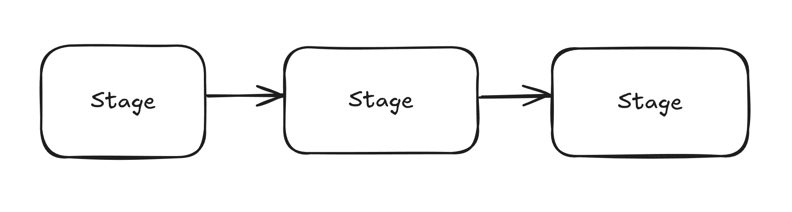
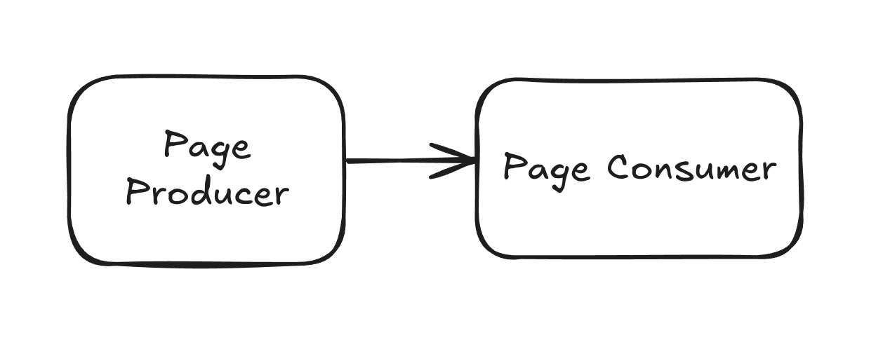
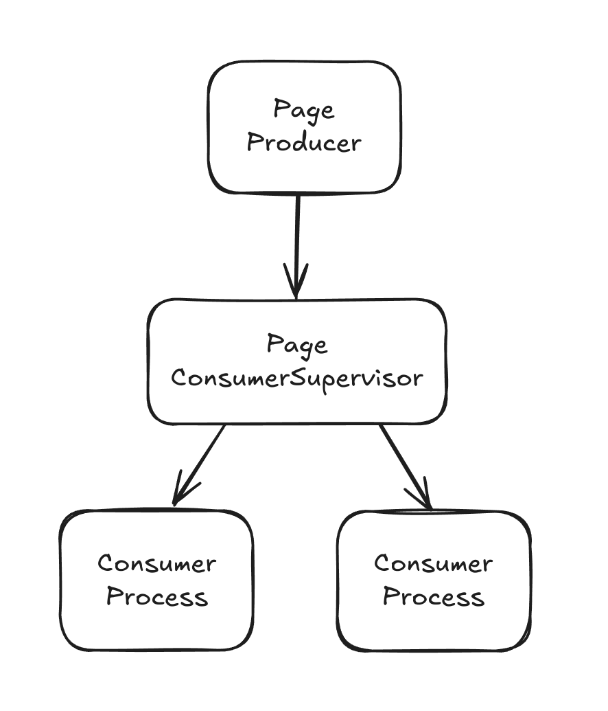

## What we will build

This article we will build a rudimentary web crawler, which is a service that will 'crawl' the web via the following process:

1. Download the HTML of an initial URL.
2. Parse the HTML to find all anchor elements, which link to other pages.
3. Download the HTML of these other pages.
4. Repeat indefinitely.

Elixir is a great tool for this, as this project is very I/O intensive and not CPU intensive, so we can make great use of
Elixir's async [Task](https://hexdocs.pm/elixir/1.12/Task.html) module for optimizing the performance, as doing this sequentally will be extremely slow.
Later, we wil see limitations with just using async tasks and how we can solve them.

## Setting up the project

First, set up the project with `mix phx.new crawler` and set up the dependencies:

```elixir title="crawler/mix.exs"
def deps do
  {:gen_stage, "~> 1.2.1"}
  {:floki, ">= 0.30.0"},
  {:req, "~> 0.5.0"},
  {:html5ever, "~> 0.15.0"}
end
```

[Floki](https://github.com/philss/floki) and [html5ever](https://github.com/servo/html5ever) will be used for parsing HTML, [req](https://hexdocs.pm/req/Req.html) 
for making http requests and [GenStage](https://hexdocs.pm/gen_stage/GenStage.html) for handling concurrency, which we will look into later.

## The naive implementation

The core business logic will remain the same accross both versions of the app, as we want to separate process logic and business logic.
It will look something like:

```elixir title="crawler/lib/crawler.ex"
defmodule Crawler do
  require Logger

  def crawl(url) do
    # download the html
    result_html = Req.get!(url).body

    # parse the document with floki
    {:ok, document} = Floki.parse_document(result_html)

    # find all anchor elements
    anchors = Floki.find(document, "a")

    # get the document title
    title = document |> Floki.find("title") |> Floki.text()
    Logger.info("Scraped page with title #{title}")

    # get the href of all anchors
    all_hrefs =
      Enum.map(anchors, fn anchor -> Enum.at(Floki.attribute(anchor, "href"), 0) end)

    new_urls =
      all_hrefs
      # filter empty hrefs
      |> Enum.filter(fn path -> not is_nil(path) end)
      # filter anchors on the same page
      |> Enum.filter(fn path -> not String.contains?(path, "#") end)
      # path might be a full url or not, if not, we will append it to the host
      |> Enum.map(fn path ->
        case String.contains?(path, "https://") do
          true -> path
          false -> url <> String.slice(path, 1..-1//1)
        end
      end)
      # remove duplicates
      |> Enum.uniq()

    # return the new urls, to be scraped
    new_urls
  end
end
```

Now, using the Task module, we can make the process of crawling an url asynchronous, and make it able to spawn more crawl requests,
so we can crawl the web indefinitely. Please don't run this function, as it has a serious problem.

```elixir title="crawler/lib/crawler.ex"
def crawl_all_urls(urls) when is_list(urls) do
  results = 
    urls
    # for each url, create an async task which crawls it
    |> Enum.map(fn url -> 
      Task.async(fn -> 
        crawl_url(url) end)
      end
      )
    # await all crawl requests
    |> Task.await_many()

  # now, crawl all of the urls in the responses
  results
  |> Enum.each(
    fn result ->
      # for each list of urls, request to crawl them again
      crawl_all_urls(result)
  )
end
```

Initially, this looks quite good. However, we have a finite amount of memory and CPU available, and this method
will exponentially create more tasks, which will, at a certain point, cause the machine to crash or go unresponsive.
This is because crawling a page might generate X more pages to be crawled, each of which will generate X more tasks,
so this will grow exponentially.

## Back-pressure and GenStage

Back-pressure is a concept used in the context of data processing, which means to slow down or stop the flow of
data. It can be used in our toy web scraper to limit the amount of work that can be done concurrently, for example,
make it so we can only scrape 10 pages at once, and the rest will be handled at a later moment. 

GenStage is an Elixir behaviour for exchanging events with back-pressure between Elixir processes, called `stages`.

Stages receive events and do something with them, and can also send events to the next stage in the pipeline.



Quoting the [GenStage documentation](https://hexdocs.pm/gen_stage/GenStage.html#module-stage-types):

> When a stage sends data, it acts as a **producer**. When it receives data, it acts as a **consumer**.
A stage may be both a **producer** and a **consumer** at the same time, acting as a **consumer producer**.

> To start the flow of events, we always subscribe consumers to producers. 
Once the communication channel between consumers and producers is established, consumers will ask producers for events.
We typically say that the consumer is sending demand upstream. Once demand arrives, the producer will emit events, never emitting more events than the consumer asked for. 
This provides a back-pressure mechanism.

## Building our pipeline

We will have a **producer** which is responsible for producing URLs to be scraped, and a **consumer**
which will scrape the URLs and parse the HTML.



Our producer will look something like this:

```elixir title="crawler/lib/crawler/page_producer.ex"
defmodule Crawler.PageProducer do
  use GenStage
  require Logger

  # this url can be anything at all
  # we are starting with the minecraft wiki
  @initial_url "https://minecraft.wiki/"

  def start_link(_args) do
    initial_state = []
    GenStage.start_link(__MODULE__, initial_state, name: __MODULE__)
  end

  def init(initial_state) do
    # kickstart the search with an initial url
    __MODULE__.scrape_urls([@initial_url])

    # specify that the stage is a producer
    {:producer, initial_state}
  end

  # handle_demand is invoked when the consumer asks for events
  def handle_demand(_demand, state) do
    # start with an empty state, as we won´t be using this function to handle demand
    {:noreply, [], state}
  end

  # this function will allow external functions to call the producer and issue
  # requests for urls to be crawled
  def scrape_urls(urls) do
    GenStage.cast(__MODULE__, {:urls, urls})
  end

  def handle_cast({:urls, urls}, state) do
    {:noreply, urls, state}
  end
end
```

For our consumer, we won't be using the default Consumer behaviour from GenStage. We will instead
use a [ConsumerSupervisor](https://hexdocs.pm/gen_stage/ConsumerSupervisor.html), which will handle concurrency
by starting a new child process per event. This allows greater concurrency and performance control.



```elixir title="crawler/lib/crawler/page_consumer_supervisor.ex"
defmodule Crawler.PageConsumerSupervisor do
  use ConsumerSupervisor
  require Logger

  def start_link(_args) do
    ConsumerSupervisor.start_link(__MODULE__, :ok)
  end

  def init(:ok) do
    # start the actual page consumer as children
    children = [
      %{
        id: Crawler.PageConsumer,
        start: {Crawler.PageConsumer, :start_link, []},
        restart: :transient
      }
    ]

    # subscribe to the page producer
    # max_demand can be used to limit concurrent consumer processes
    # here we are configuring only 2 concurrent processes
    opts = [
      strategy: :one_for_one,
      subscribe_to: [
        {ExSearch.PageProducer, max_demand: 2}
      ]
    ]

    ConsumerSupervisor.init(children, opts)
  end
end
```

Now, our actual consumer will be very small, as it only needs to implement a `start_link/1`
callback which will receive the event.

```elixir title="crawler/lib/crawler/page_consumer.ex"
defmodule Crawler.PageConsumer do
  require Logger

  def start_link(url) do
    Logger.info("PageConsumer received url #{inspect(url)}")

    # do the crawling work inside a task
    Task.start_link(fn ->
      Crawler.Crawler.work(url)
    end)
  end
end
```

## Running the project

Now we just need to register the stages in our `application.ex` file:

```elixir title="crawler/lib/application.ex"
  def start(_type, _args) do
    children = [
      Crawler.PageProducer,
      Crawler.PageConsumerSupervisor
    ]
  end
```

Run the code with `mix phx.server` and see that all is working correctly:

```bash
[info] PageConsumer received url "https://minecraft.wiki/"
[info] Scraped page with title The Minecraft Wiki
[info] PageConsumer received url "https://minecraft.wiki/w/Minecraft_Wiki:Community_portal"
[info] PageConsumer received url "https://minecraft.wiki/w/Minecraft_Wiki:Forum"
[info] Scraped page with title Minecraft Wiki:Community portal – Minecraft Wiki
[info] PageConsumer received url "https://minecraft.wiki/w/Minecraft_Wiki:Admin_noticeboard"
```

## But why not RabbitMq, SQS and co.?

This basically amounts to using the right tool for the right job. Simply using GenStage is much simpler
than adding another piece of infrastructure to your project. GenStage is very performant and lets us
avoid making more network calls, but specialized message queues are still much faster and robust. 

Specialized message queues act as persistent storage for events, making the system more resilient to failures and crashes,
while GenStage will save events in an [in-memory buffer](https://hexdocs.pm/gen_stage/GenStage.html#module-buffering), 
but this buffer has limited size and can cause events to be dropped in case demand is too high. While we can set the buffer size to be infinite,
this can cause out-of-memory errors and memory usage spikes.

Message queues also allow more versatility, like using different programming languages, dead letter queue strategies
and communicating with various differente services.

If we still want to make use of OTP and BEAM, the [Broadway](https://hexdocs.pm/broadway/Broadway.html) library is the way to go for consuming numerous types
of message queues. At a project I worked at, which was a web scraper written in Elixir, we started with GenStage
and the architecture naturally evolved to use RabbitMq and Broadway in a microsservices manner.

## Wrapping up

All the source code for this guide is available at [this github repo](https://github.com/MatheusBD15/exSearch).
I initially had the idea for this project without using GenStage, but I realized that it was the perfect fit for it,
and I plan to continue it, writing about actually making it a search engine, proxy networks and the PageRank algorithm.

Most of the tutorial and the code is inspired by Svilen's Gospodinov amazing [Concurrent Data Processing in Elixir](https://pragprog.com/titles/sgdpelixir/concurrent-data-processing-in-elixir/) book,
as this is where I initially learnt about these concepts. I really urge you to go buy the book and read it, it's easily one of the best
backend books I've read, and it goes really in depth about these concepts.